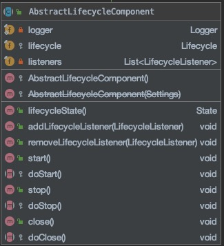

## 1. 总结
[LifecycleComponent](../component/LifecycleComponent.md)的简单实现类
- 实现了持有一个Lifecycle对象，控制对象的生命周期状态管理和转换
- 实现了对listener的注册，在状态转换时触发这些listener
## 2. 源码
[org.elasticsearch.common.component.AbstractLifecycleComponent](https://github.com/elastic/elasticsearch/blob/6.7/server/src/main/java/org/elasticsearch/common/component/AbstractLifecycleComponent.java)
