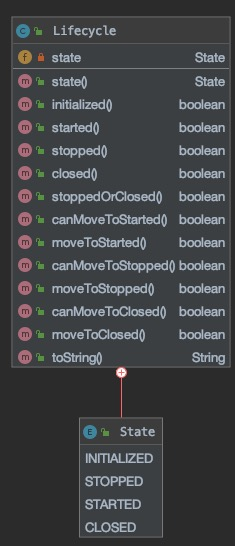

## 1. 总结
该类定义了一个包含初始化(INITIALIZED)，启动(STARTED)，停止(STOPPED)，关闭(CLOSED)四种状态及其各种转换操作的一个生命周期状态持有类，可以包含在需要该类功能的类内，用于实现生命周期的状态转换。
在ES的代码中用于`Node`, `TransportKeepAlive`, `AbstractLifecycleRunnable`, `AbstractLifecycleComponent`等需要生命周期管理的组件中。
## 2. 源码
[org.elasticsearch.common.component.Lifecycle](https://github.com/elastic/elasticsearch/blob/6.7/server/src/main/java/org/elasticsearch/common/component/Lifecycle.java)

## 3. 分析
### 3.1 概述
- 代表生命周期状态。支持如下事务：
  - INITIALIZED ：-> STARTED, STOPPED, CLOSED
  - STARTED ：-> STOPPED
  - STOPPED ：-> STARTED, CLOSED
  - CLOSED ：
- 当然也支持停留在相同的状态下，当已经处于某种状态则无需转换，如
```
public void stop() {
  if (!lifecycleState.moveToStopped()) {
    return;
  }
  // continue with stop logic
}
```
- 只有当处于stopped状态时才能close，所以在调用close前要确保已经停止了，如
```
public void close() {
  if (lifecycleState.started()) {
      stop();
  }
  if (!lifecycleState.moveToClosed()) {
      return;
  }
  // perform close logic here
}
```
### 3.2 关键字段
- private volatile State state: 组件当前的状态
### 3.3 关键方法
|方法定义|功能|
|-|-|
|State state()|获取当前的生命周期状态|
|boolean initialized()|是否处于初始化状态|
|boolean started()|是否处于started状态|
|boolean stopped()|是否处于stopped状态|
|boolean closed()|是否处于closed状态|
|boolean stoppedOrClosed()|是否处于stopped或closed状态|
|boolean canMoveToStarted()|是否可以转换为started状态，只有处于initialized或stopped时才能转换成功，如果已经处于started则返回false，如果处于closed状态则抛出IllegalStateException|
|boolean moveToStarted()|执行转换为started操作，返回情况与canMoveToStarted一样|
|boolean canMoveToStopped()|是否可以转换为stopped状态，只有started时可以转换，处于initialized和stopped返回false，如果处于closed状态则抛出IllegalStateException|
|boolean moveToStopped()|执行转换为stopped操作，返回情况与canMoveToStopped一样|
|boolean canMoveToClosed()|是否可以转换为closed状态，当处于initialized和stopped时可以转换成功，处于closed时返回false，处于started时抛出IllegalStateException|
|boolean moveToClosed()|执行转换为closed操作，返回情况与canMoveToClosed一致|
### 3.4 内部类
```
public enum State {
    INITIALIZED,
    STOPPED,
    STARTED,
    CLOSED
}
```
定义了Lifecycle的几种状态