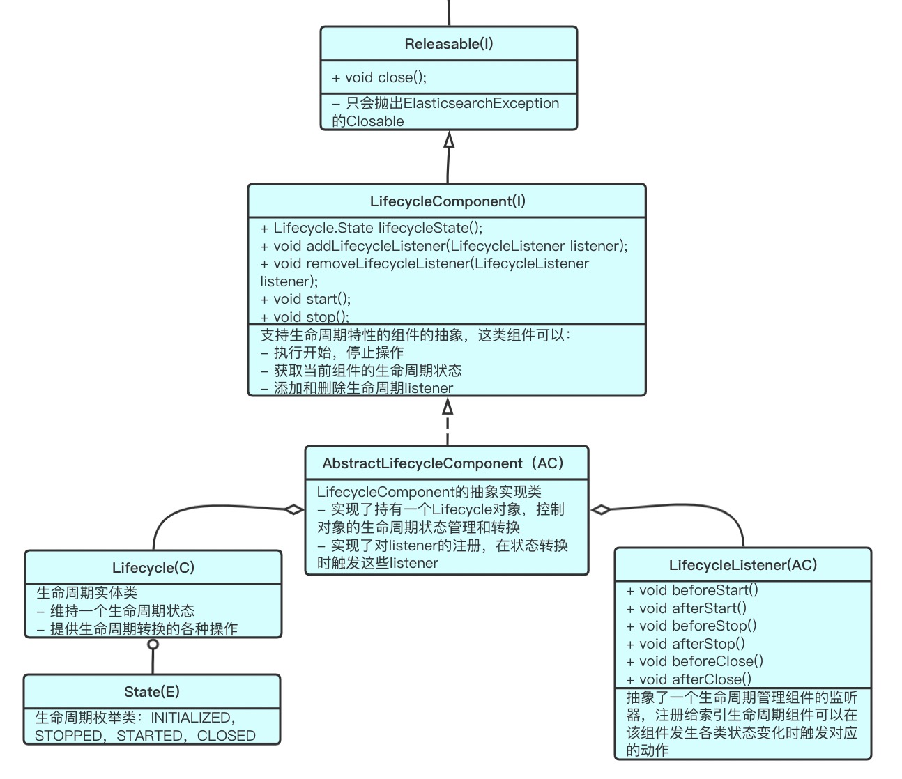

# LifecycleComponent
## 组件
Elasticsearch为有生命周期的组件抽象出了一系列类和接口，这些类和接口包括：
  - [Lifecycle](./Lifecycle.md): 生命周期实体类，提供生命周期的状态及状态转换操作
- [LifecycleListener](./LifecycleListener.md): 生命周期监听器接口，用于监听生命周期变化，并触发对应动作
- [LifecycleComponent](./LifecycleComponent.md): 具有生命周期的组件的抽象接口，这样组件可以获取生命周期状态，执行状态转换，可以注册监听器
- [AbstractLifecycleComponent](./AbstractLifecycleComponent.md): LifecycleComponent的一个简单实现，持有一个Lifecycle对象，用于实现状态持有和状态转换，持有监听器，在状态转换时触发这些监听器。

## 使用
在具体使用时，如果一个组件需要具有生命周期特性，可以在接口声明时继承`LifecycleComponent`接口，并在其实际实现类时继承`AbstractLifecycleComponent`,即可在增加少量代码的情况下实现生命周期特性。
