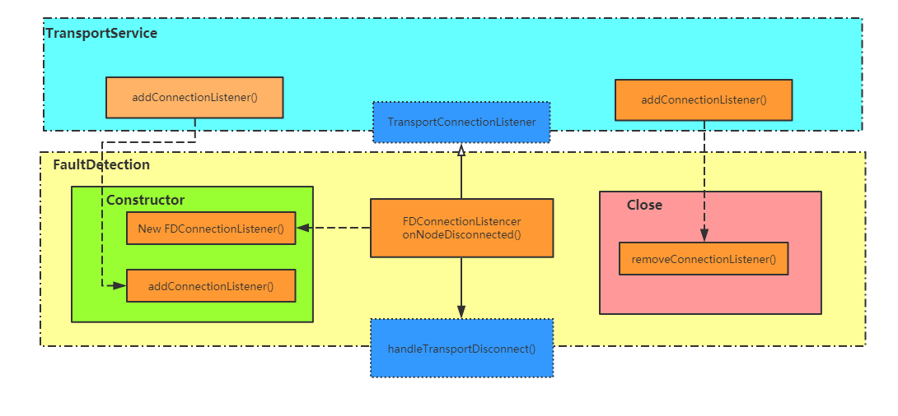
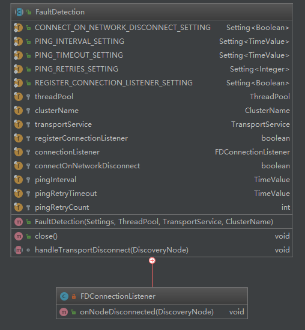

### 1.简要描述
**节点故障检测抽象类** [代码地址](https://github.com/mushao999/elasticsearch/blob/6.5_michelmu_note/server/src/main/java/org/elasticsearch/discovery/zen/FaultDetection.java)
1. **注册连接断开监听器**：该类通过在构造时调用[TransportService](../../transport/TransportService.md)的addConnnectionListener方法注册TransportPort连接变更监听器来通过节点的连接断开事件被动监听节点故障事件。该类实现了[TransportConnectionListener](../../transport/TransportConnectionListener)的一个具体实现FDConnectionListener，仅重载onNodeDisconnected来仅关注连接断开事件。
2. **对子类暴露节点断开处理方法**：该类定义了抽象方法handleTransportDisconnect，当监听器触发时会调用该方法。子类只需要重载该方法实现当节点离开时的具体处理逻辑即可。

### 2. 类结构

#### 1. 继承关系
1. 继承自[AbstractComponent](../../common/component/AbstractComponent.md)继承了一些日志，配置等通用组件相关的字段和方法
2. 实现了Closable接口，在该类中实现了Close方法，在其中调用[TransportService](../../transport/TransportService.md)的removeConnectionListener移除监听器
##### 2. 字段
1. 前几个大写的为一些配置项，参考：
- [官方文档集群故障检测（ES7.x）](https://www.elastic.co/guide/en/elasticsearch/reference/7.x/cluster-fault-detection.html)
- [官方文档节点故障检测文档（ES6.7）](https://www.elastic.co/guide/en/elasticsearch/reference/6.7/modules-discovery-zen.html#fault-detection)
2. threadPool用于另起线程执行连接断开事件：因为可能与多个连接断开事件，不能因为一个而阻塞了其他的处理
3. clusterName:可能两个子类都用到了所以就放在了父类里？？？
4. TransportService用于添加或移除FDConnectionListener
5. registerConnectionListener es测试环境下使用的参数，正式环境中始终为true，表示是否注册监听器
6. connectionListener要注册的监听器,在构造器中初始化，在构造器中注册，在close中移除
7. 下面这几个为前面定义的配置项的获取值
  - connectOnNetworkDisconnect：配置项discovery.zen.fd.connect_on_network_disconnect标识发现连接断开后是否尝试恢复连接
  - pingInterval：配置项discovery.zen.fd.ping_interval表示故障检测时间间隔
  - pingRetryTimeout：配置项discovery.zen.fd.ping_timeout表示ping的超时时间
  - pingRetryCount：配置项discovery.zen.fd.ping_retrie表示检测失败重试次数
##### 3. 方法
1. 构造器：构造器做了如下几件事情：
  - 获取配置项
  - 获取传入参数
  - 生成监听器
  - 注册监听器
2. close方法：只做了一件事，移除监听器
3. **handleTransportDisconnect**：抽象方法，为子类预留的连接断开处理方法
##### 4. 内部类
该类定义了一个内部类**FDConnectionListener**实现了[TransportConnectionListener](../../transport/TransportConnectionListener)接口，并仅对连接断开的接口方法进行了实现，以实现对连接断开的处理。
