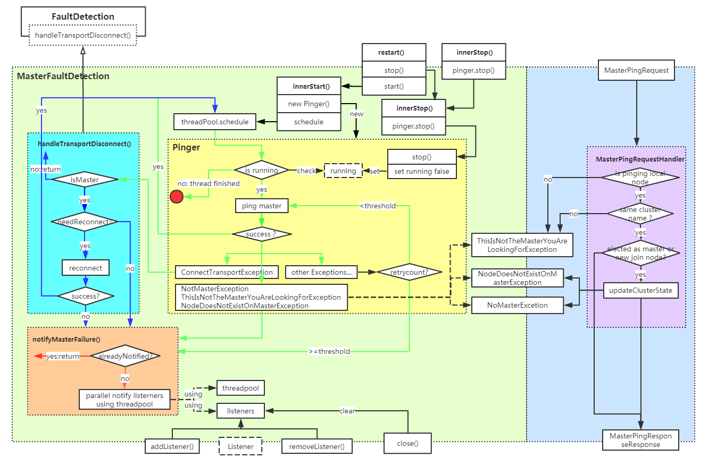

参考文章：
- [官方文档集群故障检测（ES7.x）](https://www.elastic.co/guide/en/elasticsearch/reference/7.x/cluster-fault-detection.html)
- [官方文档节点故障检测文档（ES6.7）](https://www.elastic.co/guide/en/elasticsearch/reference/6.7/modules-discovery-zen.html#fault-detection)
- [ElasticSearch Master、Node故障检测](https://www.jianshu.com/p/9f7282288858)

### 1.简述
**主节点故障检测类** 
[代码地址](https://github.com/mushao999/elasticsearch/blob/6.5_michelmu_note/server/src/main/java/org/elasticsearch/discovery/zen/MasterFaultDetection.java) 
该类的功能主要有：
1. **主节点故障被动检测及处理（Listener）** ：当前类继承自[FaultDetection](./FaultDetection.md)，重写该类的handleTransportDisconnect方法，来实现当有transport连接断开事件发生时，若判断为主节点断开，则通知相应的Lisener。
2. **主节点故障主动检测及处理（Pinger）** ：该类的resart方法启动定时执行的ping任务，对主节点进行连接检测，如果出现异常进行相应的处理
3. **注册并实现响应主节点故障检测的接口（internal:discovery/zen/fd/master_ping）** ：注册一个响应主节点故障检测ping的接口，以响应其他节点的ping主节点请求
4. **提供注册和移除主节点故障监听器方法** : 该类定义了一个Listener接口，通过调用当前类的[addListener](#addListener)和[removeListener](#removeListener)方法可以添加或移除监听器。需要监听主节点故障的业务可以通过这两个方法添加或移除对主节点故障事件的监听。

图中 
- 左侧绿色大框内为故障检测逻辑（作为数据节点时主要运行的部分）
  - 蓝色部分为被动故障检测逻辑
  - 黄色部分为主动故障检测逻辑
  - 橘色部分为故障通知逻辑
- 右侧蓝色部分为ping请求接收（作为主节点时主要运行的部分）
  - 紫色部分为请求处理的核心逻辑
- 该类对外主要暴露的接口有 restart()、 stop()、addListener()和removeListener()， close(),以及响应ping的接口
该类初始化完成后被动检测已经开启，restart开启主动检测， stop关闭主动检测， addListener和removeListener添加监听器，close()释放所有listener，响应ping的接口用于处理其他节点发送来的ping请求
### 3.类结构

#### 1.继承关系
继承自类[FaultDetection](./FaultDetection.md)，该类实现了对Transport连接断开事件的监听，并对子类暴露了handleTransportDisconnect方法，子类只需要重写该方法接口实现对Transport连接断开事件（节点故障）的监听。
#### 2.字段
1. MASTER_PING_ACTION_NAME：常量，响应其他节点ping主节点请求的接口名称
2. MasterService：用于在当前节点被选为主节点或有新节点加入集群时获取最新的集群状态
3. clusterStateSupplier：由外部传入，用于获取集群的最新状态，如当前的所有节点等
4. listeners：主节点故障监听器列表，如果主节点故障则会并发通知各Listener，可以通过方法添加或移除。
5. masterPinger：主节点的ping检测器，用于主动检测节点故障。为当前类内部类MasterPinger的一个对象，在主节点变更，故障等情况下会改变。
6. masterNodeMutex ：互斥量，用于同步主节点故障检测的各动作包括重启，停止，被动检测，主动检测等。
7. retryCount：主动检测时，发现故障的重试次数。
8. notifiedMasterFailure：故障通知标识，表示是否已经通知过故障，防止重复通知。
#### 3. 方法
1. 构造器：（1）接收一些外部变量（2）注册响应主节点故障检测的接口
2. masterNode： 获取当前正在监听的主节点
3. **addListener** 添加主节点故障监听器
4. **removeListener** 移除主节点故障监听器
5. **restart**：重启主节点故障检测，用于当停止当前的检测进程，并对新指定的主节点进行检测。
6. innerStart： 启动检测的具体实现（1）初始化一些设置如主节点，重试次数，通知标识等（2）停止现有检测进程（3）启动新的定时检测任务
7. **stop**： 停止主检点故障检测
8. innerStop： 停止检测的具体实现（1）重试次数置空（2）停止现有进程（2）置空master节点
9. close：重写父类方法，用于释放资源：（1）关闭父类（移除Transport连接监听器）（2）关闭检测（3）监听器列表置空
10. **handleTransportDisconnect**：重写父类方法，当被动出现连接断开，或主动检测发生连接断开时，调用。
（1）过滤非主节点的故障事件（2）如果开启了断连重试开关，再会再次尝试连接，如果成功则继续检测，如果失败则调用[notifyMasterFailure](#notifyMasterFailure)通知（3）如果没有开启重试开关，则直接调用[notifyMasterFailure](#notifyMasterFailure)通知
11. notifyMasterFailure:发现节点故障后的通知动作（1）判断是否已通知标识，如果已通知则直接返回(2)未通知则会并发通知各Listener
#### 4. 内部类
1. masterPinger:主动检测的实际执行类
（1）该类实现了Runnable，可以直接被threadPool.schedule直接调度
（2）只有一个字段running，为是否运行开关，初始化为ture，通过stop开关可以设置为false，从而停止线程
（3）实际执行内容为：1.没有设置主节点则直接进入下一循环（原理上不会发生，防御）;2.发起对主节点的ping请求；3.如果ping正常，且未换主节点则设置下一次的定时任务（如果设置的主节点发生变化，就不ping了，当前只会在restart或stop时设置master所以不会触发这个，防御）；4.如果出现异常，如果是连接失败，则需要调[handleTransportDisconnect](#handleTransportDisconnect)通知；NotMasterException，ThisIsNotTheMasterYouAreLookingForException，NodeDoesNotExistOnMasterException异常则直接调用[notifyMasterFailure](#notifyMasterFailure)通知即可，其他异常的话如果没有达到重试次数则重试，达到重试次数则调用[notifyMasterFailure](#notifyMasterFailure)通知。**所以此处需要注意，主节点故障检测重试次数，并不是所有失败都重试，只有对除去ConnectTransportException，NotMasterException，ThisIsNotTheMasterYouAreLookingForException，NodeDoesNotExistOnMasterException之外的场景适用，当然断连会有一次重连如果开启了开关**
2. MasterPingRequestHandler：用于处理主节点故障检测请求
（1）如果当前节点不是主节点，或请求集群名称和当前集群名称不一致，则抛出ThisIsNotTheMasterYouAreLookingForException
（2）当节点刚被选为主节点或节点不在集群列表中，则调用masterService更新节点信息（！！！此处的判断条件要研究一下）
（3）对于正常的请求，返回空的MasterPingResponseResponse即可
3. ThisIsNotTheMasterYouAreLookingForException：当前主节点不是请求中要找的主节点异常
4. NodeDoesNotExistOnMasterException：节点不存在异常（即使更新了节点状态也没有找到该节点）
5. MasterPingRequest ping主节点请求定义
6. MasterPingResponseResponse ping主节点response定义
