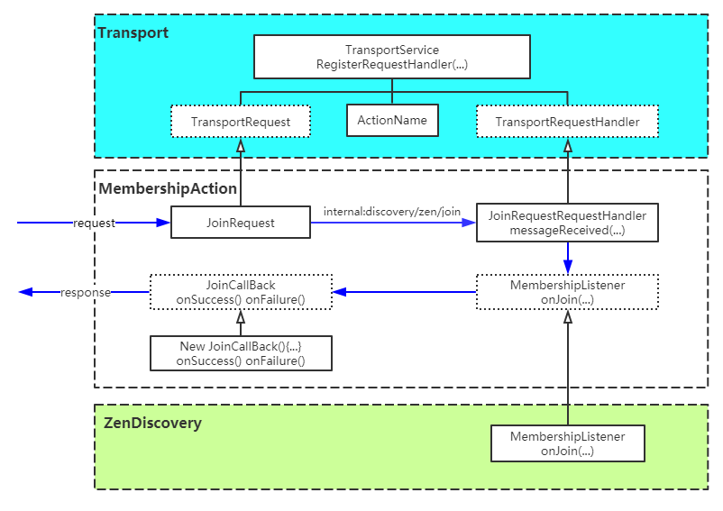
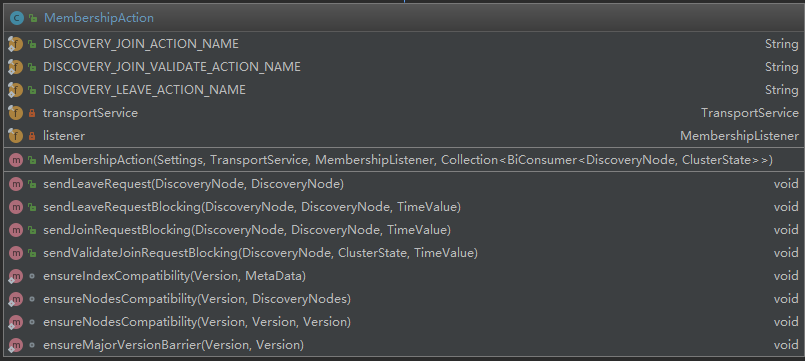

https://github.com/mushao999/elasticsearch/blob/6.5_michelmu_note/server/src/main/java/org/elasticsearch/discovery/zen/MembershipAction.java
### 1. 简述
**节点关系交互动作类** 
该的类功能有三：
1. **向其他节点发请求**: 封装了对其他节点的 *加入集群*，*加入集群验证*, *离开集群* 等请求
2. **注册接受其他节点请求的接口**: 注册接受其他节点 *加入集群*，*加入集群验证*, *离开集群* 等请求的接口，以便接受并处理其他节点的请求。
3. **提供了三个内置的加入集群验证器**：用于在节点加入集群时对节点进行验证，包括版本兼容性验证，索引兼容性验证等。
### 2. 详细描述
1. **发起请求**：直接调用[TransportService](../../transport/TransportService.md)的发起请求类进行请求发送
该类是节点关系交互的核心类，该类的功能包括：
1. 向其他节点发送``加入集群``，``加入集群验证``和``离开集群``的请求:直接调用transportService发送请求
2. 注册并实现处理其他节点``加入集群``,``加入集群验证``和``离开集群``的请求的handler：有一套transportService注册接口的机制，核心点如下：
    1. 通过TransportService的registerRequestHandler注册一个aciont path到handler的映射，实现对一个节点请求的处理
    2. 为了完成注册需要实现一个[TransportRequest](../../transport/TransportRequest.md)的子类和[TransportRequestHandler](../../transport/TransportRequestHandler.md)
    3. 当前类的handler中只是实现了公共的接收请求和返回响应的逻辑，实际的处理逻辑要调用listener的onJoin和onLeave等来实现
    4. 在调用listener的onJoin和onLeave时会同步传入执行完成callback，以在实际逻辑处理成功或失败时，调用callback来产生返回报文。
    
3. 提供一些内置的加入集群验证器

#### 2. 成员描述

##### 1. 字段
1. DISCOVERY_JOIN_ACTION_NAME、DISCOVERY_JOIN_VALIDATE_ACTION_NAME、DISCOVERY_LEAVE_ACTION_NAME分别定义了``加入集群``,``加入集群验证``和``离开集群``的请求action名，用于发出请求和注册handler时使用
2. transportService用于发起transport请求或注册handler用于接收其他节点的请求
3. listener为接收到请求的监听器，当接收到请求时会调用listener中定义的对应方法

##### 2. 方法
1. 构造器中主要就是注册Listener（用于当接收到请求时回调该listener中定义的方法）和注册请求的handler（用于接收请求并进行处理）
1. sendLeaveRequest, sendLeaveRequestBlocking, sendJoinRequestBlocking,  sendValidateJoinRequestBlocking为直接调用transportService发起对主节点请求的函数封装
2. ensureIndexCompatibility, ensureNodesCompatibility, ensureMajorVersionBarrier为提供了一些内置的的加入集群校验方法

##### 3. 内置类
1. 为了处理其他节点发送过来的``加入集群``、``加入集群验证``和``离开集群``请求，该类提供了三组内置类，分别为(JoinRequest, JoinRequestRequestHandler),(ValidateJoinRequest,ValidateRequestRequestHandler),(LeaveRequest, LeaveRequestRequestHandler)用于对和三类请求的请求体和处理方式进行定义。
2. 内部接口MemberShipListener用于定义处理这些请求时的监听器，当该类接收到上面定义的三种请求，会回调该Listener中的onJoin和onLeave
3. 内部接口JoinCallBack用于定义当具体的加入请求执行成功或失败后回调的方法onSuccess, onFailure
